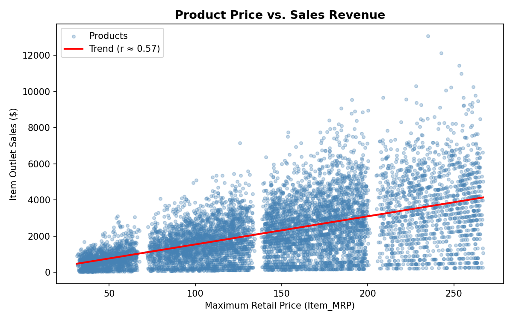
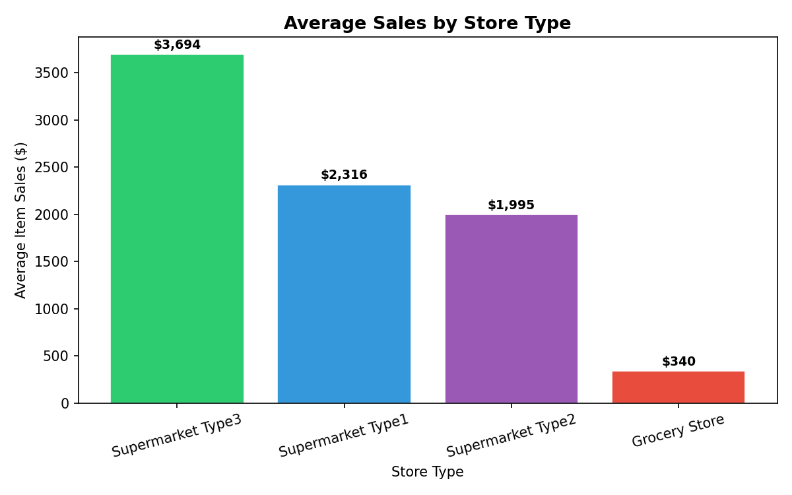
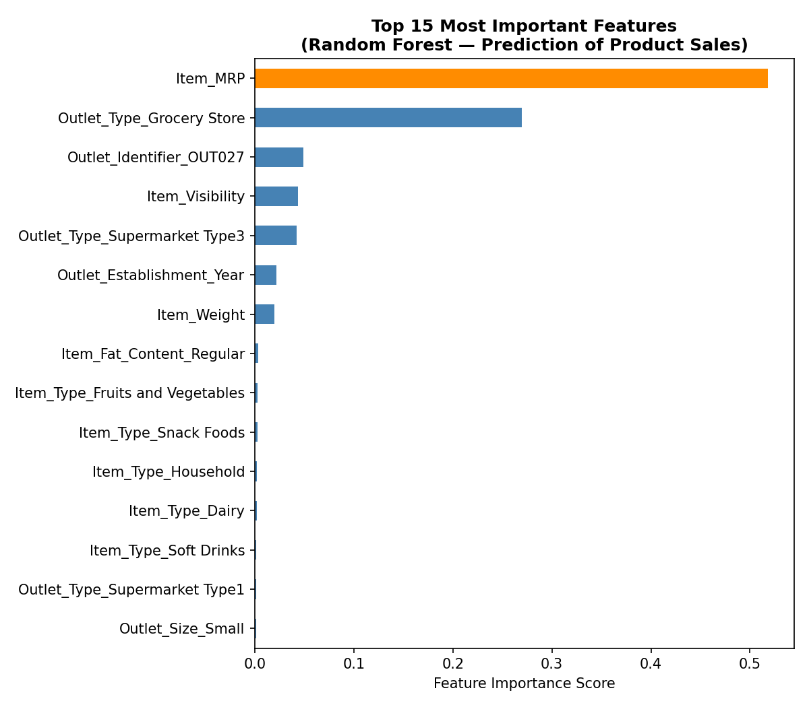

# Prediction of Product Sales

### Author: Salam Odeh

---

## Project Overview

Retailers carry thousands of products across multiple store types and locations. Understanding **which products are likely to sell well — and why** is critical for inventory planning, shelf-space allocation, and revenue forecasting.

This project applies machine learning to a retail sales dataset containing **8,523 product-outlet combinations** across 10 store locations. The goal is to build a model that predicts `Item_Outlet_Sales` — the dollar amount a product generates at a specific store — based on product attributes (price, type, weight, visibility) and store attributes (type, size, location tier, age).

The full analysis follows the **CRISP-DM framework**:
1. Business Understanding
2. Data Understanding & Cleaning
3. Exploratory Data Analysis
4. Feature Inspection
5. Preprocessing & Modeling
6. Evaluation & Deployment (this README)

---

## Data

**Source:** BigMart Sales Dataset (2023)

**Size:** 8,523 rows × 12 columns

| Variable | Description |
|---|---|
| Item_Weight | Weight of the product |
| Item_Fat_Content | Low Fat or Regular |
| Item_Visibility | % of store display area allocated to this product |
| Item_Type | Product category (16 types) |
| Item_MRP | Maximum Retail Price (list price) |
| Outlet_Identifier | Unique store ID |
| Outlet_Establishment_Year | Year the store was established |
| Outlet_Size | Small, Medium, or High (store size) |
| Outlet_Location_Type | Area tier (Tier 1 / 2 / 3) |
| Outlet_Type | Grocery Store or Supermarket Type 1/2/3 |
| **Item_Outlet_Sales** | **Target — sales in dollars** |

---

## Key Insights

### Insight 1: Product Price is the Strongest Driver of Sales

The single most predictive feature is `Item_MRP` (the product's list price), with a Pearson correlation of **r ≈ 0.57** with sales. Higher-priced products consistently generate more revenue per outlet.

*Products priced above $150 MRP generate disproportionately higher sales. This trend is consistent and linear, making price the most reliable lever for predicting — and influencing — sales performance.*

---

### Insight 2: Store Type Has a Dramatic Impact on Sales

The type of outlet a product is sold in matters far more than the product category itself. The difference between store types is stark:

| Store Type | Average Item Sales |
|---|---|
| Supermarket Type 3 | **$3,694** |
| Supermarket Type 1 | $2,316 |
| Supermarket Type 2 | $1,995 |
| Grocery Store | **$340** |

*Grocery Store outlets generate on average **91% less revenue per product** than Supermarket Type 3 stores. This represents the largest single opportunity for the retailer: store-type mix has a bigger impact on total revenue than any product-level attribute.*

---

## Model Summary

Three models were built and compared:

| Model | Test R² | Test MAE | Test RMSE | Overfit? |
|---|---|---|---|---|
| Linear Regression | 0.567 | $844 | $1,096 | No (gap < 0.01) |
| Random Forest (default) | 0.560 | $766 | $1,106 | Yes (gap = 0.38) |
| **Random Forest (tuned)** | **0.597** | **$734** | **$1,055** | **Minimal (gap = 0.10)** |

**Recommended model: Tuned Random Forest**

The tuned Random Forest achieves the best test performance with a well-controlled overfitting gap. It was tuned using cross-validated grid search over tree depth, minimum leaf size, and number of trees.

### Feature Importance

The model's internal feature importance scores confirm the findings from EDA and Linear Regression coefficients:

`Item_MRP` accounts for **44% of all decision splits** in the Random Forest — by far the most important feature. `Outlet_Type` (specifically the Grocery Store vs. Supermarket distinction) is the second most important group of features.

### Interpreting Model Performance

Our best model explains approximately **60% of the variation in product sales** across all product-outlet combinations. In practical terms:

> *"On average, our model's sales predictions are within **$734** of the actual sales figure. For a product with typical sales of around $2,181, this represents an error margin of roughly 34% — useful for relative comparisons and ranking products/outlets, but predictions should be treated as estimates rather than precise forecasts."*

The remaining 40% of variance is likely driven by factors not captured in this dataset: local competition, seasonal demand, promotional activity, and customer demographics.

---

## Conclusions and Business Recommendations

1. **Price is the primary lever:** `Item_MRP` is the strongest predictor of sales. Products with higher list prices consistently generate more revenue, independent of store type. Retailers should consider MRP when making stocking decisions.

2. **Invest in store-type upgrades:** The gap between Grocery Store (~$340 avg. sales) and Supermarket Type 3 (~$3,694) is enormous. Converting or upgrading outlet formats represents the highest-impact structural change the retailer can make.

3. **Increase visibility for key products:** `Item_Visibility` (the share of shelf space allocated to a product) ranks as the 4th most important feature. Reallocating display space toward high-MRP products in larger store types is a low-cost, high-return action.

4. **The model supports inventory planning:** While the model does not achieve perfect accuracy, a test R² of 0.60 and MAE of $734 makes it suitable for ranking products and outlets by expected sales — enabling more informed stocking, purchasing, and pricing decisions.

---

## Repository Contents

| File | Description |
|---|---|
| `Prediction_of_Product_Sales.ipynb` | Full analysis notebook (EDA → Modeling → Insights) |
| `sales_predictions_2023.csv` | Raw dataset |
| `insight1_price_vs_sales.png` | Price vs. Sales scatter plot |
| `insight2_sales_by_outlet_type.png` | Average Sales by Outlet Type bar chart |
| `rf_feature_importance_readme.png` | Random Forest feature importance chart |

---

## Tools and Libraries

Python · Pandas · NumPy · Matplotlib · Seaborn · scikit-learn (LinearRegression, RandomForestRegressor, GridSearchCV, Pipeline, ColumnTransformer)
