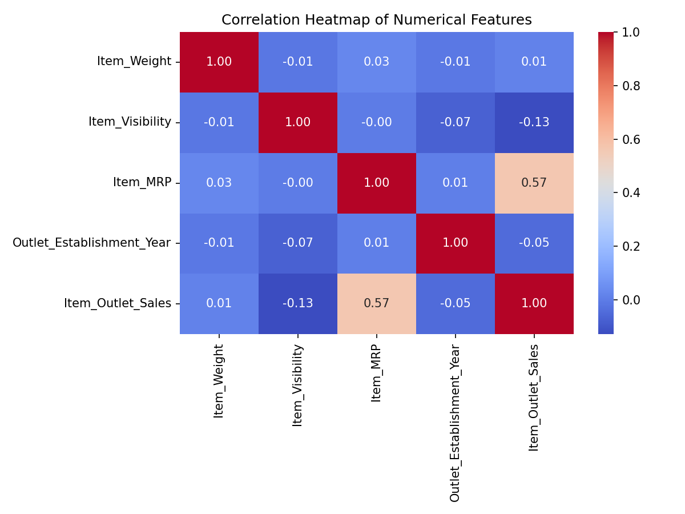
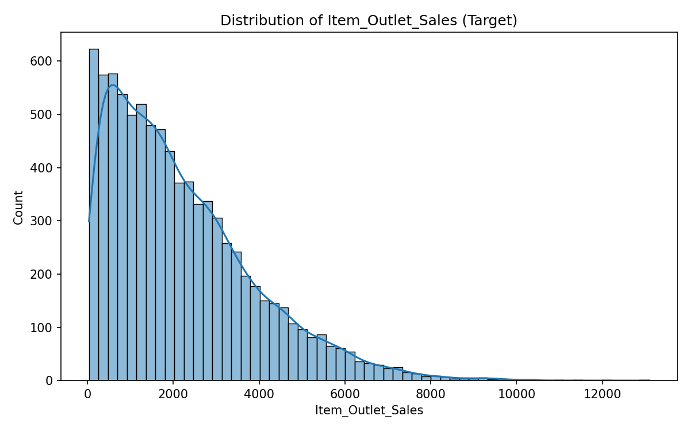

# Prediction of Product Sales

## Introduction

This is a Data Science portfolio project completed as part of the AXSOS Academy Introduction to Machine Learning course. The goal is to help a retailer understand the properties of products and outlets (stores) that play a crucial role in increasing sales, and to build a machine learning model that can predict `Item_Outlet_Sales` for products at various outlets.

**Dataset:** `sales_predictions_2023.csv` — 8,523 rows describing products, outlets, and historical sales, with the following data dictionary:

| Variable Name | Description |
|---|---|
| Item_Identifier | Unique product ID |
| Item_Weight | Weight of product |
| Item_Fat_Content | Whether the product is low fat or regular |
| Item_Visibility | The percentage of total display area of all products in a store allocated to the particular product |
| Item_Type | The category to which the product belongs |
| Item_MRP | Maximum Retail Price (list price) of the product |
| Outlet_Identifier | Unique store ID |
| Outlet_Establishment_Year | The year in which store was established |
| Outlet_Size | The size of the store in terms of ground area covered |
| Outlet_Location_Type | The type of area in which the store is located |
| Outlet_Type | Whether the outlet is a grocery store or some sort of supermarket |
| Item_Outlet_Sales | Sales of the product in the particular store. This is the target variable to be predicted. |

## Repository Structure

This project follows the CRISP-DM process and is broken into 6 notebooks:

- `Part1_Setup.ipynb` — Project setup and notebook structure
- `Part2_Load_Clean.ipynb` — Load, explore, and clean the data
- `Part3_EDA.ipynb` — Exploratory data analysis and visuals
- `Part4_Feature_Inspection.ipynb` — Detailed inspection of every feature
- `Part5_Preprocessing.ipynb` — Train/test split and preprocessing pipeline
- `Part6_Modeling.ipynb` — Linear Regression and Random Forest modeling, tuning, and evaluation

## Key Visuals

### 1. Correlation Heatmap

This heatmap shows that `Item_MRP` (price) has the strongest correlation with `Item_Outlet_Sales` (r ≈ 0.57) among all numeric features, making it the most useful numeric predictor of sales.

### 2. Distribution of Item_Outlet_Sales

The target variable `Item_Outlet_Sales` is right-skewed, meaning most products generate relatively low sales while a smaller number of products drive much higher sales revenue.

## Modeling Summary

Three models were built and compared: Linear Regression, a default Random Forest, and a Random Forest tuned with `GridSearchCV`. See `Part6_Modeling.ipynb` for full results, metrics, and the final model recommendation.

## Tools Used

Python, Pandas, NumPy, Matplotlib, Seaborn, scikit-learn (Pipeline, ColumnTransformer, SimpleImputer, StandardScaler, OneHotEncoder, LinearRegression, RandomForestRegressor, GridSearchCV).
